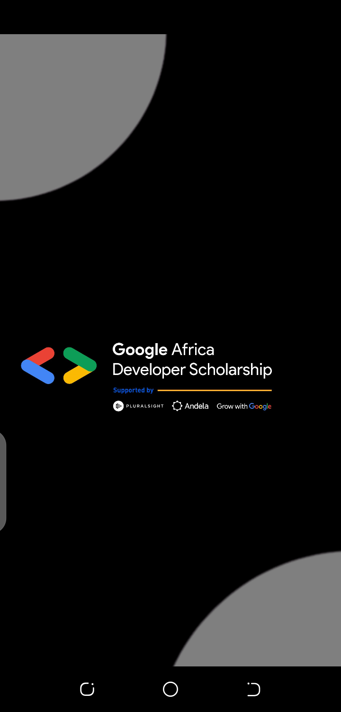
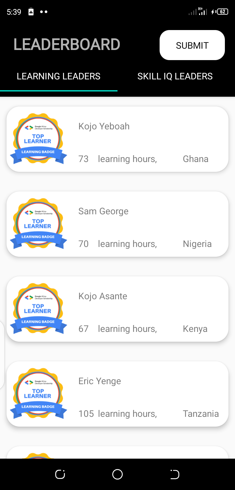
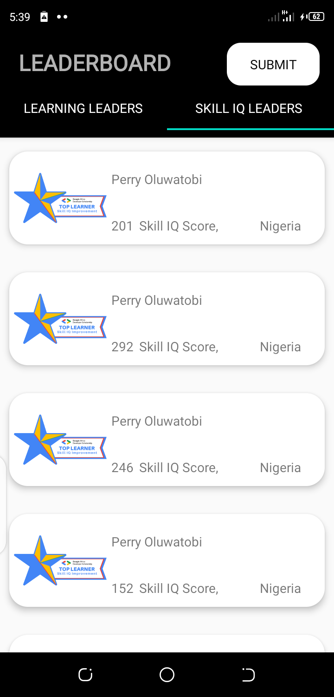
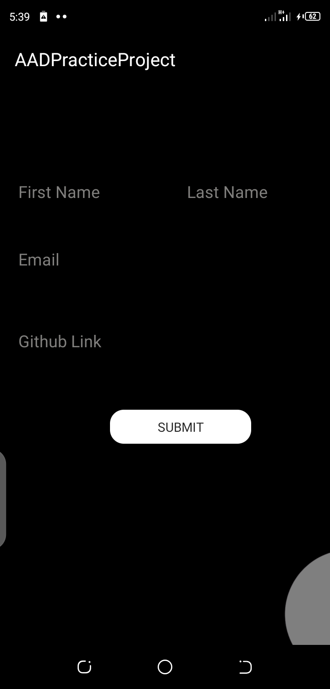
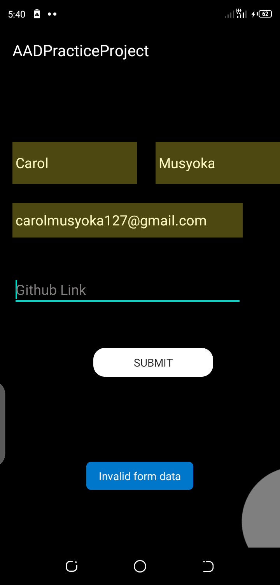
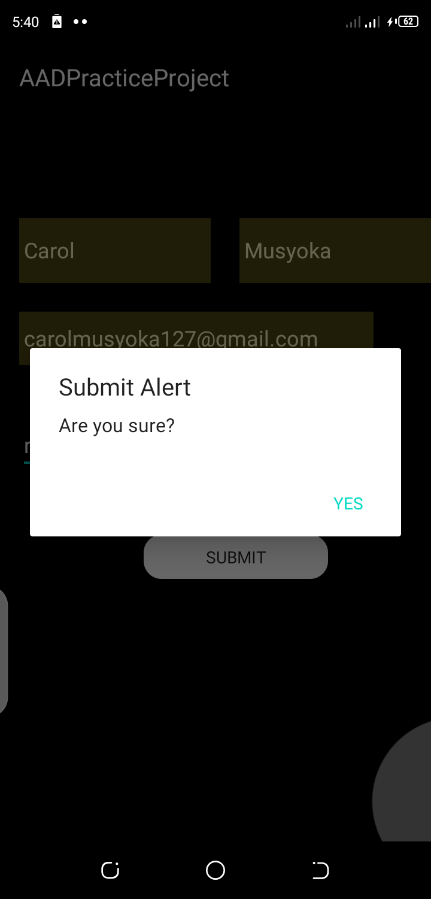
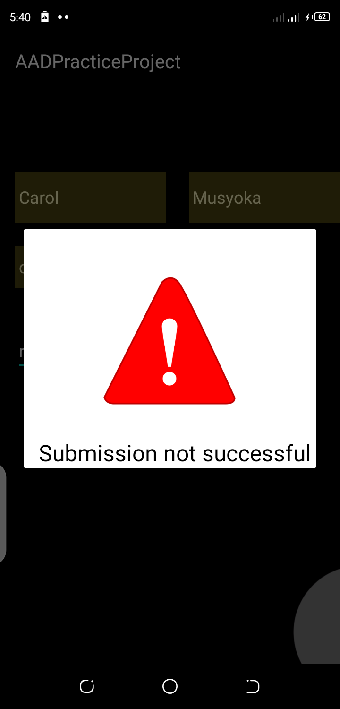
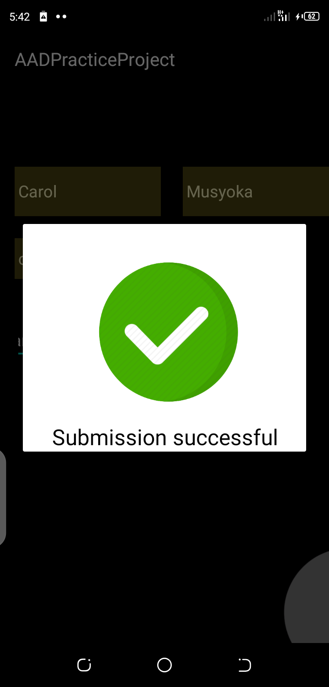

# AADPracticeProject

Practice project for the GADS 2020- Android Track

This project implements a mobile design of the GADS 2020 Leaderboard.
The mobile App will display Top 20 learners in the Learning Leaders’ category and Top 20 learners in the Skill IQ Leaders’ category.

## Aim of the project
This project will help you understand:
- [x] Multi-Activity
- [x] Fragments
- [x] View pager
- [x] Customizing Toolbar
- [x] RecyclerViews
- [x] Making Network Request
- [x] Working with Google Form

### API EndPoints
- Base URL - https://gadsapi.herokuapp.com
- Learning Leaders - /api/hours
- Skill IQ Leaders - /api/skilliq

### Project Submission 

- Make a NETWORK POST request to this Google Form using any network library. 
[Retrofit is recommended.]
- Base url - https://docs.google.com/forms/d/e/
- Form ID-1FAIpQLSf9d1TcNU6zc6KR8bSEM41Z1g1zl35cwZr2xyjIhaMAz8WChQ/formResponse
- FullURL- https://docs.google.com/forms/d/e/1FAIpQLSf9d1TcNU6zc6KR8bSEM41Z1g1zl35cwZr2xyjIhaMAz8WChQ/formResponse

- Entries IDs:
Email Address = entry.1824927963
Name = entry.1877115667
Last Name = entry.2006916086
Link to project = entry.284483984

# Project Flow.

  

 

 
 

